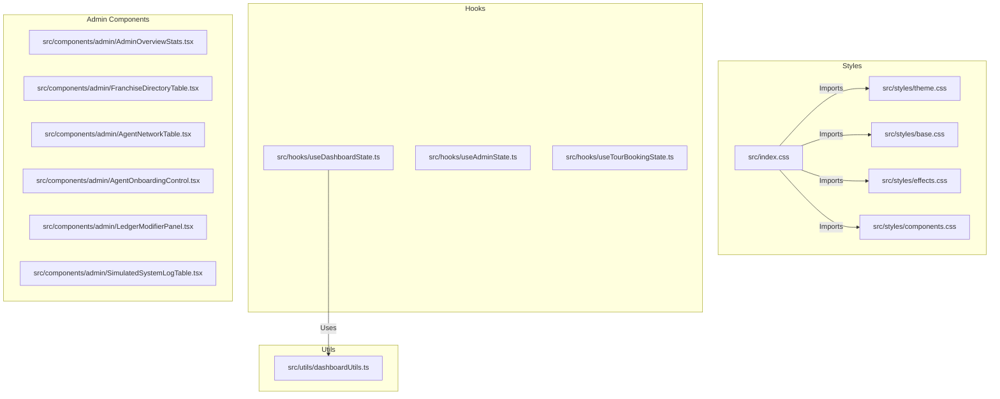

# Spec: Large Components Refactoring Design

This document details the refactoring design for cleaning up the Beduine frontend codebase by decomposing large, state-heavy page components into modular hooks, subcomponents, and styles.

## Goals

Reduce the lines of code (LOC) in the key orchestrators and stylesheets to follow these targets:
- `DashboardPage.tsx`: 150–250 lines (previously 1,403 lines)
- `AdminPage.tsx`: 120–200 lines (previously 950 lines)
- `TourBookingForm.tsx`: 180–280 lines (previously 1,156 lines)
- `index.css`: import-only file, ideally under 20 lines (previously 2,260 lines)

### Guardrails
- **No behavior change**: All extracted hooks and components must preserve existing prop names, UI output, localStorage keys, mock data shape, and payment/dashboard/admin behavior.

---

## Architecture Design

---

## File Structure & Responsibilities

### 1. Styles (`src/styles/` and `src/index.css`)
- `theme.css`: Tailwind `@theme` directives, keyframes, colors.
- `base.css`: Standard browser tag overrides (`html`, `body`), scrollbar, typography.
- `effects.css`: Cursors, noise overlay, vignettes, particles, aurora backgrounds, gradient meshes.
- `components.css`: Glassmorphism, CTA buttons, Beduine card layouts.
- `index.css`: Flat import file.

### 2. Admin Workspace (`src/components/admin/` & `src/hooks/useAdminState.ts`)
- `useAdminState.ts`: Holds initial mock franchises and agents state, and manages payout releases, user resets, and balance changes.
- `AdminPage.tsx`: Layout container validating role credentials and rendering the modular tables/forms.
- Modular panels extracted:
  - `AdminOverviewStats.tsx`: Key metrics & revenue comparison.
  - `FranchiseDirectoryTable.tsx`: State-wise office directory list.
  - `AgentNetworkTable.tsx`: Mapped agents payouts, targets, and commission logs.
  - `AgentOnboardingControl.tsx`: Form to map and register new agents.
  - `LedgerModifierPanel.tsx`: Modifier for wallet credits & balance.
  - `SimulatedSystemLogTable.tsx`: simulated master ledger logger.

### 3. Tour Booking Wizard (`src/hooks/useTourBookingState.ts` & `src/pages/main-website-tour-page/TourBookingForm.tsx`)
- `useTourBookingState.ts`: Manages pricing memos, Supabase sync, lead traveler autofill, pickup updates, policy details, and booking flow coordination.
- `TourBookingForm.tsx`: Mounts header, horizontal stepper, custom accordions matching active steps (1 to 5), and footer policies.

### 4. User Dashboard (`src/hooks/useDashboardState.ts` & `src/utils/dashboardUtils.ts` & `src/DashboardPage.tsx`)
- `dashboardUtils.ts`: Decoupled helpers (`generateMockParticipants`, `getParticipantVerification`, `generateRandomToken`, file exporters).
- `useDashboardState.ts`: Tab routing state, profile forms, demo wallets, custom support requests, and weekly draws.
- `DashboardPage.tsx`: Coordinates sidebar items, layouts, and hooks tab contents.

---

## Verification Plan

### Automated Verification
After each major component cleanup phase, we must run:
1. `npm run typecheck` (Checks TypeScript compilation without emit)
2. `npm test` (Runs Vitest test suites)
3. `npm run build` (Must finish successfully; warnings, e.g. chunk size, should be reviewed but not treated as failures unless new warnings are introduced)
